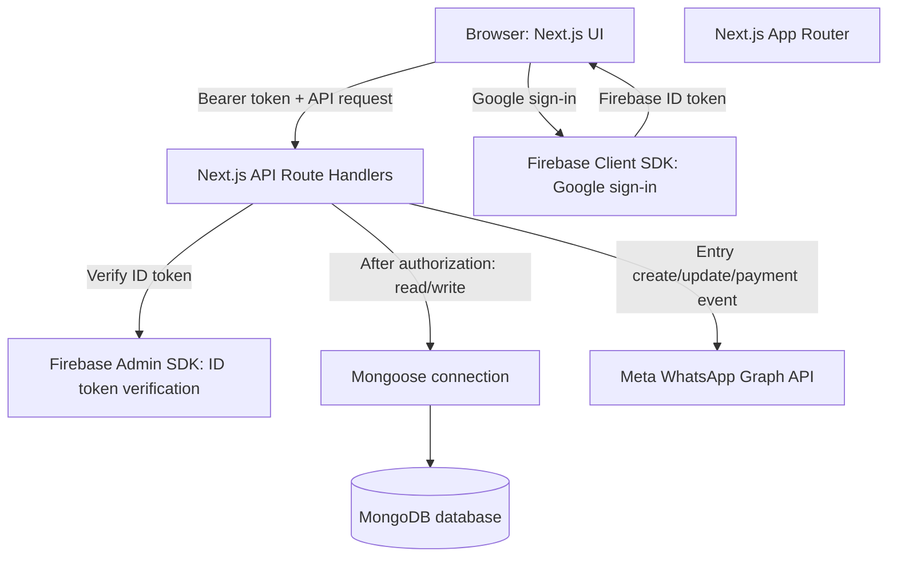
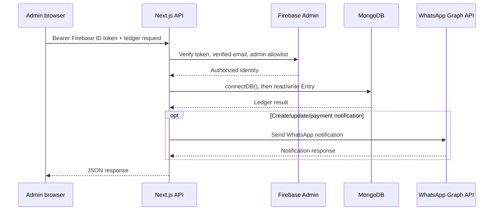

# Easy Tech Solution Architecture

এই নথিটি বর্তমান কোডের architecture বর্ণনা করে। Firebase এবং MongoDB আলাদা কাজ করে: Firebase admin identity যাচাই করে, আর MongoDB application-এর ledger data সংরক্ষণ করে।

## High-level architecture

## Main components

| অংশ | দায়িত্ব |
| --- | --- |
| `src/app` | Next.js pages এবং `/api/*` Route Handlers |
| `src/components/DashboardApp.tsx` | Dashboard/ledger-এর client-side workflow |
| `src/lib/firebase-client.ts` | Browser-side Firebase app, Google provider এবং Firebase Auth |
| `src/lib/firebase-admin.ts` | Server-side Firebase Admin initialization, ID token verification এবং admin email allowlist |
| `src/lib/api-auth.ts` | Protected API request-এর Bearer token যাচাই |
| `src/lib/db.ts` | Mongoose দিয়ে MongoDB connection তৈরি ও cache |
| `src/models/Entry.ts` | Ledger entry/payment schema এবং status automation |
| `src/models/Admin.ts` | পুরনো user ID/password login-এর admin schema |
| `src/lib/whatsapp.ts` | Entry event হলে Meta WhatsApp API-তে notification পাঠায় |

## Google sign-in: Firebase কখন ব্যবহৃত হয়

1. Admin `/admin/login` পেজে Google sign-in চাপেন। `firebase-client.ts`-এর Firebase Client SDK Google popup চালায়।
2. Browser-এ sign-in সফল হলে client Firebase ID token নেয়। Client-side allowlist check-ও হয়।
3. Client `POST /api/auth/firebase`-এ ID token পাঠায়। Server Firebase Admin SDK দিয়ে token verify করে, email verified কি না এবং `ADMIN_EMAILS` allowlist-এ আছে কি না পরীক্ষা করে।
4. Dashboard-এর API call-এ `src/lib/client-api.ts` বর্তমান Firebase user-এর ID token `Authorization: Bearer ...` header-এ পাঠায়।
5. Protected API-তে `requireAdmin()` token verify করে। Firebase token গ্রহণ করার আগে verified email এবং server-side admin allowlist মিলিয়ে দেখা হয়।

Firebase এখানে user/admin identity ও token verification-এর জন্য ব্যবহৃত হয়; ledger entry Firebase-এ লেখা হয় না.

## MongoDB কখন ব্যবহৃত হয়

- `/api/entries`-এর GET/POST, `/api/entries/[id]`-এর PUT/DELETE, payment এবং import handler-গুলো আগে `requireAdmin()` দিয়ে authorization করে, তারপর database operation-এর আগে `connectDB()` ডাকে।
- `/api/auth/login` পুরনো user ID/password login route। এটি MongoDB-তে `Admin` খোঁজে, bcrypt দিয়ে password hash মেলায়, তারপর JWT দেয়।
- `connectDB()` `MONGO_URI` দিয়ে Mongoose connect করে। Connection/promise `globalThis`-এ cache করা, তাই একই server process-এ পরের request-গুলো connection reuse করতে পারে।
- Ledger data `Entry` model-এ থাকে। Payment entry-এর nested array; `createdAt` ও `updatedAt` Mongoose timestamps থেকে আসে। Save-এর সময় status স্বয়ংক্রিয়ভাবে `Complete` বা `Due Later` হতে পারে।

MongoDB connection lazy: server চালু হলেই সাধারণত database query শুরু হয় না; যেই API route `connectDB()`-এ পৌঁছায়, তখন connection প্রয়োজন হয়।

## Protected ledger request flow

## Legacy JWT login

`/login` currently redirects to `/admin/login`, so the visible login flow is Firebase Google sign-in. Nevertheless, `POST /api/auth/login`, `Admin` model, and JWT helpers remain in the codebase. `requireAdmin()` tries Firebase token verification first and then verifies a JWT with `JWT_SECRET` if Firebase verification fails. The current `client-api.ts` sends the Firebase current user's token; it does not store or send the legacy login JWT. Treat the MongoDB password login as a legacy/parallel API path, not as the normal UI login flow.

## API surface

| Method | Path | কাজ |
| --- | --- | --- |
| `POST` | `/api/auth/firebase` | Firebase ID token ও admin access যাচাই |
| `GET` | `/api/auth/me` | Current Bearer token যাচাই করে admin identity ফেরত |
| `POST` | `/api/auth/login` | Legacy MongoDB user ID/password login; JWT ফেরত |
| `GET`, `POST` | `/api/entries` | Ledger entry list/create |
| `POST` | `/api/entries/import` | JSON array থেকে entry import |
| `PUT`, `DELETE` | `/api/entries/[id]` | Entry update/delete |
| `POST` | `/api/entries/[id]/payments` | Payment যোগ |

Ledger API-গুলো authenticated admin-এর জন্য। Create/update/payment-এর কিছু event-এ WhatsApp notification-ও পাঠানো হয়।

## Configuration boundaries

সঠিক value project-এর local/deployment environment-এ রাখতে হবে; এই নথিতে secret/value রাখা হয়নি.

- Browser Firebase config: `NEXT_PUBLIC_FIREBASE_*`; client-side admin email check: `NEXT_PUBLIC_ADMIN_EMAILS`
- Server Firebase Admin credentials: `FIREBASE_PROJECT_ID`, `FIREBASE_CLIENT_EMAIL`, `FIREBASE_PRIVATE_KEY`; server-side admin allowlist: `ADMIN_EMAILS`
- MongoDB: `MONGO_URI`
- Legacy JWT: `JWT_SECRET`, optional `JWT_EXPIRES_IN`
- WhatsApp integration: `WHATSAPP_ACCESS_TOKEN`, `WHATSAPP_PHONE_NUMBER_ID`, `WHATSAPP_TEMPLATE_NAME`; optional `WHATSAPP_TEMPLATE_LANGUAGE` and `WHATSAPP_GRAPH_API_VERSION`

`NEXT_PUBLIC_*` variables browser bundle-এ প্রকাশিত হয়; সেখানে password, private key, database URI বা অন্য secret রাখা যাবে না। Server-only credential কেবল server environment-এ রাখুন.

## Source of truth

- **Admin authentication:** Firebase Google Auth (বর্তমান UI flow)
- **Business/ledger records:** MongoDB via Mongoose
- **Legacy authentication:** MongoDB `Admin` + JWT endpoint/helper (রয়ে গেছে, তবে বর্তমান login UI এটি ব্যবহার করে না)
- **Notifications:** Meta WhatsApp Graph API (ঐচ্ছিক integration)
